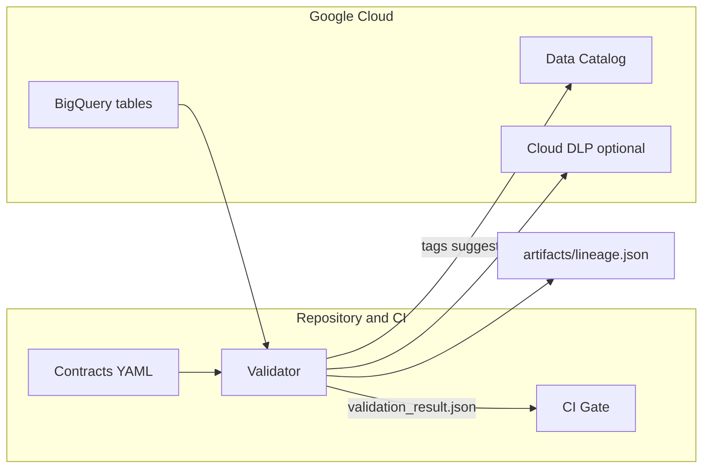

# gcp-ml-data-trustkit

Data Trust kit for ML on **Google Cloud**: **YAML data contracts**, **PII checks** (lightweight heuristics, Cloud DLP optional), **lineage artifact**, **Data Catalog tag suggestions**, and a **CI gate** that fails when the contract is broken.

---

<p align="left">
  <a href="../actions"></a>
  <a href="LICENSE"></a>
  
</p>

> Replace badges with your repo paths: `https://github.com/<user>/<repo>/...`

## Why

* Prevent **silent schema drift** and **unsafe data** from entering ML pipelines.
* Provide **auditable evidence** (contracts + lineage + PII summary) before training.
* Shift‑left governance: break the build **before** resources are spent in training.

## Highlights

* **Contracts as code** (YAML) for schema, nullability, value domains, ranges.
* **PII scan**: portable regex heuristics by default; pluggable Cloud DLP.
* **Lineage artifact**: minimal JSON graph (dataset → feature table) for dashboards.
* **Data Catalog**: suggested tags based on PII summary (stub included).
* **CI gate**: reusable workflow to block PRs on violations.

## Architecture



---

## Quickstart (local CSV)

```bash
python3 -m venv .venv && source .venv/bin/activate
pip install -r src/validator/requirements.txt
python src/validator/validate_contract.py \
  --contract contracts/dataset_contract.yaml \
  --data bq/sample/curated.csv \
  --out artifacts
```

**Pass:** prints `✅ Contract validation passed` and writes:

* `artifacts/validation_result.json`
* `artifacts/lineage.json`

**Fail:** exits with non‑zero status and lists violations (missing/extra columns, type/nullable mismatch, domain/range).

### Run from CI (gate)

`.github/workflows/contract-gate.yml` calls the validator on every PR and `main` push. If the contract fails, the job fails and the merge is blocked.

---

## Contracts

A contract is a YAML document that declares the schema and constraints. Example:

```yaml
name: curated_customer_events
owner: data-platform@company.example
schema:
  - name: feature_1
    type: float
    nullable: false
    constraints: { min: -1e6, max: 1e6 }
  - name: feature_2
    type: float
    nullable: false
  - name: feature_3
    type: float
    nullable: false
  - name: target
    type: int
    nullable: false
    constraints: { allowed_values: [0, 1] }
pii:
  expected: low
  fields: []
```

Supported checks out of the box:

* **Presence**: missing/extra columns
* **Types**: `int`, `float`, string (basic coercion checks)
* **Nullability**: forbid nulls when `nullable: false`
* **Value domain**: `allowed_values`
* **Ranges**: `min` / `max`

> Extend `src/validator/contracts.py` to add new constraint types (regex, max length, etc.).

---

## PII scanning

By default the validator runs **lightweight heuristics** (regex) against sample values to flag obvious **EMAIL** and **PHONE** patterns. See `src/validator/dlp_classifier.py`.

### Using Cloud DLP (optional)

Integrate the official client inside `dlp_classifier.py` and map findings to the `{ field, hits }` shape that the validator expects. Minimal sketch:

```python
from google.cloud import dlp_v2
client = dlp_v2.DlpServiceClient()
# build InspectConfig / ContentItem from column samples and call client.inspect_content(...)
```

> This repo ships with the portable regex fallback to keep it runnable everywhere.

---

## Lineage and Catalog

* **Lineage**: `src/validator/lineage.py` writes a tiny graph (`artifacts/lineage.json`). You can render it in your dashboards or export to a lineage system of choice.
* **Data Catalog**: `src/validator/catalog.py` returns **suggested tags** from the PII summary. Replace the stub with `google-cloud-datacatalog` to write real tags.

---

## Folder structure

```
.
├─ contracts/                # YAML data contracts
├─ src/validator/            # validator + PII + lineage + catalog stubs
├─ bq/                       # sample data and DDL
├─ .github/workflows/        # CI gate
├─ scripts/                  # one-time setup & helpers
└─ docs/                     # architecture notes
```

---

## Scripts

* `scripts/run_validation_local.sh` – venv + install + local validation (CSV).
* `scripts/one_time_setup.sh` – enable GCP APIs (DLP, Data Catalog, BigQuery).
* `scripts/load_sample.sh` – load the sample CSV to BigQuery (optional).

---

## Sample output (truncated)

```json
{
  "contract": "curated_customer_events",
  "valid": true,
  "pii_summary": {
    "feature_1": {"field": "feature_1", "hits": [], "count": 3}
  },
  "lineage": "artifacts/lineage.json",
  "suggested_tags": [{"policy": "pii", "level": "none"}]
}
```

---

## Troubleshooting

* **Type mismatch**: ensure numeric fields are parseable (`1`, `1.0`), no extraneous symbols.
* **Nulls not allowed**: drop or impute before validation.
* **Extra/missing columns**: update the source or the contract, but bump the **contract version** if breaking.
* **CI fails**: download `artifacts/validation_result.json` from the job and inspect `errors`.

---

## Roadmap

* Cloud DLP inspector helper (first‑class).
* Data Catalog write of tags and taxonomy.
* OPA/Rego policy gate for waivers and conditional exceptions.
* BigQuery direct reader and contract versioning.

---

## Security

No secrets in repo. Prefer **OIDC → GCP** for CI runners. See `SECURITY.md` if present.

## License

MIT (see `LICENSE`).
